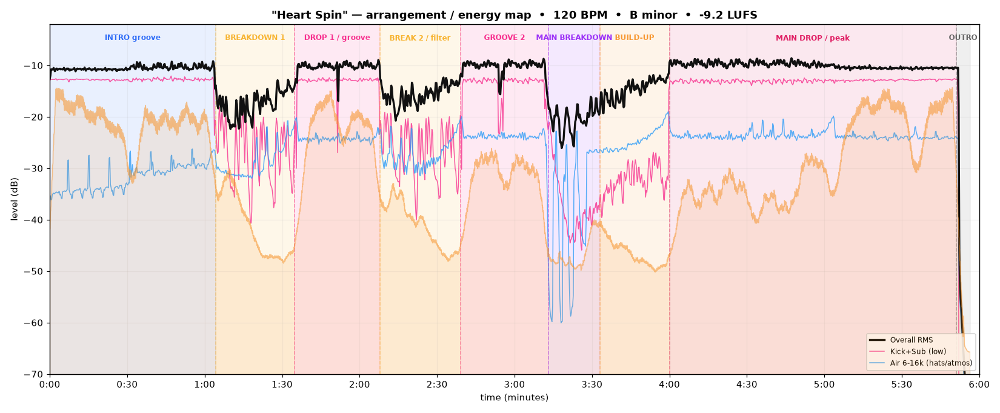
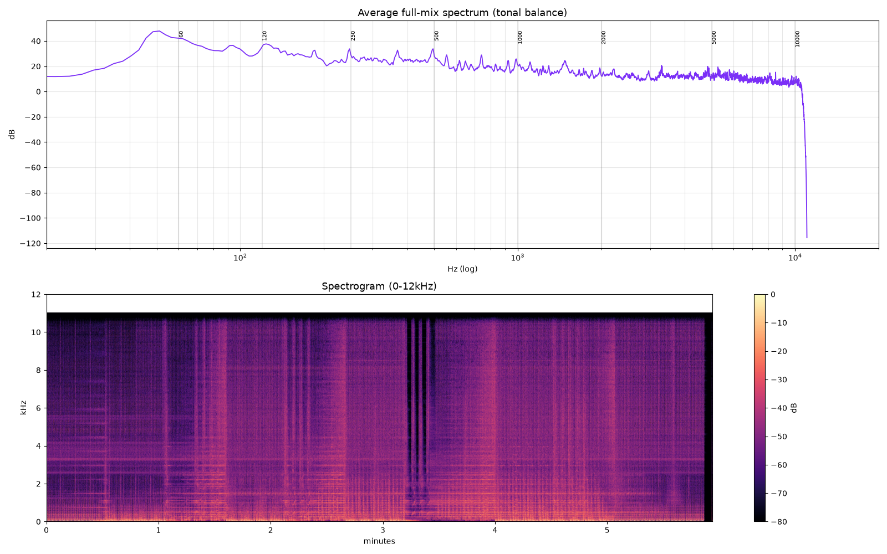

# Track Analysis & Recreation Guide — *"Heart Spin"* (Original Mix)

**Samm (BE) & JUNO (DE)** · Magnifik Music · released 29 May 2026 · Melodic / Progressive House

> Goal of this document: reverse-engineer *what makes "Heart Spin" sound the way it does* — its
> tempo, key, arrangement, instrumentation, groove, mix and master — and turn that into a concrete,
> DAW-ready recipe for producing a track in the same world. Every number below was **measured from the
> audio file** with the scripts in [`scripts/`](scripts/); genre technique is layered on top.

---

## 0. TL;DR — the sonic fingerprint

| Property | Value (measured) | What it means for you |
|---|---|---|
| **Tempo** | **120 BPM** (120.09 measured; some catalog metadata lists ~122) | Classic melodic-prog tempo. Set project to 120. |
| **Key / tonal centre** | **B minor** (rel. G major; hints of B Dorian) | Bassline roots on **B** and **G** → an **i–VI (Bm → G)** feel. |
| **Length / structure** | 5:56, DJ-friendly "Original Mix" | Intro groove → 2 mini-breaks → **big emotional breakdown** → build → main drop → outro. |
| **Loudness** | **−9.2 LUFS** integrated, LRA ≈ 5.7, crest ≈ 14.7 dB, true-peak just >0 dBFS | Hot, club/Beatport-loud master that still breathes (kept some dynamics). |
| **Kick** | Fundamental **≈49 Hz (~G1)**, tight **~100 ms** decay | Punchy, sub-heavy but *short* — not a boomy 808. Tuned near the root. |
| **Low end** | Sub + kick dominate; strong bass-heavy spectral tilt | ~+30 dB more energy at 50 Hz than at 10 kHz. |
| **Stereo** | Bass/sub **near-mono** (side 22–26 dB under mid); mids/highs **wide**; L/R corr **0.81** | Mono lows for power & club translation, wide tops for space. |
| **Groove** | Pronounced **sidechain pump** locked to the kick; **offbeat hi-hats** | The "breathing" pump is a defining feature — everything ducks to the kick. |

*Above: overall RMS (black), low-end kick+sub (pink), air/hats (blue) and transient density (orange fill)
across the full track. The section boundaries were detected from the audio.*

---

## 1. Track anatomy (the arrangement)

Melodic progressive house is built for a DJ set: a long, mixable intro, tension/release via breakdowns,
and a big emotional centre. "Heart Spin" follows the template almost to the bar. Timestamps are measured
from the energy map; sections are phrased in tidy 16/32-bar blocks (≈16 s and ≈32 s at 120 BPM).

| # | Time | Section | Energy | What's happening |
|---|------|---------|--------|------------------|
| 1 | **0:00 – 1:07** | **Intro groove** | −10.6 dB (full) | Full four-on-the-floor from the top: kick, rolling sub-bass, hats, percussion, light atmospherics. A DJ mix-in section — groove-first, hook held back. |
| 2 | **1:07 – 1:35** | **Breakdown 1** | −17.4 dB | Kick/sub filtered out, energy drops ~7 dB. Melodic/pad content surfaces; a short emotional dip. |
| 3 | **1:35 – 2:08** | **Drop 1 / groove** | −10.2 dB | Beat + bass snap back. First full statement of the main groove + lead. |
| 4 | **2:11 – 2:39** | **Break 2 / filter** | −15.6 dB | Second, shorter filtered breakdown — a breather that resets tension before the centre-piece. |
| 5 | **2:39 – 3:13** | **Groove 2** | −10.3 dB | Groove returns, layers thickening toward the peak. |
| 6 | **3:13 – 3:35** | **Main breakdown** ⭐ | −17.1 dB | The emotional core. Kick drops out, big reverbed chords/pads, and **rhythmic gated/chopped stabs** (clear vertical "chop" columns in the spectrogram). This is the moment the track is written around. |
| 7 | **3:35 – 4:00** | **Build-up** | rising | Long riser: white-noise sweep up, rising synth, snare/clap roll accelerating, low-end filtered, tension climbing to the top. |
| 8 | **4:00 – 5:51** | **Main drop / peak** ⭐ | −10.0 dB | Everything hits at once — the loudest, widest, most complete version of the groove. Sustained for ~1:50. |
| 9 | **5:51 – 5:56** | **Outro** | fade | Quick filter/level-out to a DJ-friendly tail. |

**Phrasing rule of thumb** (120 BPM): 1 bar = 2 s, 8 bars = 16 s, 16 bars = 32 s. Change/introduce an
element every **8 or 16 bars**; place your biggest transitions on **32-bar** boundaries. Note how the two
"mini" breaks (~28 s each) and the main breakdown (~22 s break + ~25 s build) all land on clean phrase
lines.

---

## 2. Instruments & sound design — element by element

For each part: **what it is** in the track, then **how to recreate it**. Synth names are the common tools
for this sound (any equivalent works — the *technique* matters more than the plugin).

### 2.1 Kick 🥁
- **What it is:** Punchy, tight kick with its fundamental at **~49 Hz (≈G1)** — tuned into the key — and a
  short **~100 ms** decay. Sub-heavy weight but a fast tail, so it stays clubby and doesn't mask the bass.
- **Recreate it:**
  - Start from a clean house/prog kick sample layered with a **sub/body layer** tuned to **G1 (~49 Hz)** or
    the track root **B0/B1**. Two layers: a *click/top* (2–5 kHz transient for laptop/phone translation) +
    a *body/sub* (40–60 Hz).
  - Keep the tail **short** (decay ~90–120 ms). Gate or shorten if it rings.
  - High-pass everything else out of its way; the kick owns 40–70 Hz.
  - Tools: sampled one-shot + *Kick 2 / Kickstart-style shaper*, or synthesised in Serum/Operator (sine +
    fast pitch envelope from ~150 Hz → 49 Hz over 30–50 ms).

### 2.2 Bass (the rolling sub/bassline) 🎸
- **What it is:** A **rolling, mono, sub-dominant bass** that roots on **B** and moves to **G** (measured
  roots: B0, G1, plus G#/A/A# passing tones) — i.e. the **Bm → G** (i–VI) motion that gives the track its
  warm, hopeful-melancholic pull. It sits *under* the kick and **pumps** with it (sidechain).
- **Recreate it:**
  - Single-oscillator or dual-osc **sine/triangle** bass (add a touch of saw for the 200–600 Hz "growl" that
    lets it be heard on small speakers). Serum/Diva/Sylenth1 all do this in one patch.
  - Write an **offbeat / rolling 1/8 or 1/16 pattern** locked to the kick — root on **B**, then **G**, using
    the scale degrees B–D–F#–G–A. Keep it **mono below ~120 Hz** (see §4).
  - **Sidechain the bass to the kick** so it ducks on every kick (this is 50% of the genre's feel).
  - Layer split: a pure **sub sine** (mono, no effects) below ~120 Hz + a **mid-bass** (100–800 Hz, can be
    slightly wider, light saturation) above it.

### 2.3 Lead / plucks / arps 🎹
- **What it is:** The melodic hook — bright, plucky, delay/reverb-drenched notes that carry the topline over
  the groove. Spectral centre of the mix sits ~2.9 kHz, consistent with a present-but-not-harsh lead.
- **Recreate it:**
  - **Pluck:** short amp envelope (fast attack, ~200–400 ms decay, low sustain) on a saw/square through a
    lowpass with a little envelope-to-cutoff. Add a **1/4 or dotted-1/8 delay** (ping-pong) + a lush plate/hall
    reverb on a send. This "call-and-echo" is the signature melodic-prog lead texture.
  - **Arp:** same patch, 1/16 arpeggiator, notes from the B-minor scale outlining Bm–G–D–A. Automate the
    filter cutoff to open across a phrase.
  - Keep the lead **wide** (unison detune / stereo delay) but carve 200–400 Hz so it doesn't muddy the bass.
  - Tools: Serum (saw + unison), Spire, Sylenth1; the classic "Anjunadeep pluck".

### 2.4 Chords & pads 🌌
- **What it is:** Warm, evolving chords that own the breakdowns and glue the drops. Voiced around Bm / G / D
  / A, with the occasional **G#** colour (a borrowed/Dorian brightening) that lifts the emotion.
- **Recreate it:**
  - **Pad:** detuned saws or a wavetable through a slow lowpass, long attack/release, slow LFO on cutoff or a
    unison-detune for movement. Big hall reverb on a send; automate its send up in the breakdown.
  - **Chord progression:** **Bm – G – D – A** (i – VI – III – VII) is the melodic-prog workhorse and matches
    the measured harmony. Try **Bm – G – A** for a more suspended feel, or borrow **E major** for the "G#"
    lift in the breakdown.
  - **Voicing:** keep chords in the mid/upper register (leave the low octave to the bass); use inversions so
    the top note moves melodically.
  - Layer a **piano** or bell under the pad in the breakdown for the emotional peak — very on-genre.

### 2.5 Atmospheres, risers & FX 🌊
- **What it is:** The transitions are glued with **white-noise sweeps** (up before drops, down after),
  **impacts/booms** on downbeats, **reverse cymbals/reverb tails**, and the **gated/chopped stabs** heard in
  the main breakdown (the rhythmic vertical columns in the spectrogram).
- **Recreate it:**
  - **Uplifter/downlifter:** filtered white noise automated in pitch/cutoff over 4–8 bars into each drop; a
    reverse-reverb tail leading into the "1".
  - **Impact:** a boom/sub-drop + reversed crash on the downbeat of each drop.
  - **Gated stab:** take a chord/pad, run it through a **rhythmic gate / tremolo** (1/16 pattern) or chop it
    with volume automation, drown it in reverb, and **sidechain it** so it stutters in time. That's the
    breakdown's "chopped" texture.
  - **Vocal/atmos chops** (very common in this genre): a one-word or "ahh" vocal, pitched to the key,
    chopped and reverb-fed — even if subtle it adds the human, emotional layer.

### 2.6 Percussion & hi-hats 🎶
- **What it is:** Active groove: **offbeat hi-hats** (open hat on the "&"), closed-hat 1/16 fills, shakers,
  claps/snare on 2 & 4-ish accents, light percussion loops. The transient-density curve shows the hats
  thinning in breaks and rebuilding through the build-up.
- **Recreate it:**
  - **Open hat on the offbeat** (the "and" of each beat) — the core house groove. Closed hats fill 1/16s with
    velocity variation for swing.
  - Add **shaker + light perc loop** for movement; a **clap/snare** layered for the backbeat.
  - Apply a little **swing (~52–56%)** and sidechain the hat bus lightly for cohesion.
  - Keep percussion **wide** in the stereo field (see §4) — it's what makes the top half feel big.

---

## 3. Groove & the sidechain "pump"

The single most genre-defining feel here is the **sidechain pumping**: the bass, pads, chords and FX all
**duck on every kick** and swell back between kicks, at 120 BPM. Measured, the low end is deeply modulated in
lockstep with the 4/4 kick.

**Recreate it:**
1. Route bass, chords, pads and most melodic/FX buses through a **compressor keyed by a "ghost" kick**
   (a silent kick trigger), or use an LFO-shaped volume tool (LFOTool / Kickstart / Volume-Shaper).
2. Shape: **fast attack**, release timed so the level is ~80–90% recovered by the next kick
   (at 120 BPM, one beat = 500 ms; release ~300–400 ms).
3. Depth: heavier on bass/pads, lighter (or off) on the lead/topline so the melody stays present.
4. This does two jobs: it **makes room for the kick** in the low end *and* creates the rhythmic "breathing"
   that is the pulse of melodic/progressive house.

---

## 4. The mix

Measured tonal balance (relative dB of the average full-mix spectrum) and stereo width per band:

| Band | Level (relative) | Stereo (side − mid) | Reading |
|---|---|---|---|
| Sub 20–60 Hz | **37.9** (loudest) | −25.7 dB → **near-mono** | Huge, centred sub foundation. |
| Kick/Bass 60–120 | 34.4 | −22.6 dB → **near-mono** | Kick + bass body, kept mono for punch. |
| Low-mid 120–400 | 27.6 | −7.6 dB | Bass harmonics, some width. |
| Mid 400–2 k | 18.8 | −3.4 dB → **widest** | Chords, pluck body, vocals — spread wide. |
| High-mid 2–6 k | 12.6 | −4.5 dB | Pluck presence, hat body. |
| Air 6–16 k | 7.8 (quietest) | −6.7 dB | Hats, sparkle, reverb tails. |

*Overall L/R correlation **0.81** — wide but mono-compatible.* *Spectral centroid ~2.9 kHz, 85% rolloff
~6.1 kHz.*

**The mix philosophy to copy:**
- **Bass-heavy tilt.** A gentle downward slope from sub → air (~−4 to −6 dB/oct). The low end is meant to be
  felt; the top is airy sparkle, not aggressive.
- **Mono lows, wide highs.** Everything below ~120 Hz collapsed to **mono** (power, club translation, clean
  low end). Pads, plucks, hats and FX pushed **wide** with stereo delays, unison detune and mid/side EQ.
- **Kick + bass share the sub by taking turns** — sidechain + tight kick decay means they never fight.
- **Carve for clarity:** high-pass non-bass elements ~150–250 Hz; dip pads/leads ~200–400 Hz to unmask the
  bass; small presence lift ~3–8 kHz on the lead; air shelf on hats/pads.
- **Reverb as depth, not mud:** short-to-medium plates on the groove, big halls on breakdown pads — on
  **sends**, high-passed so reverb doesn't cloud the low end.

---

## 5. The master

Measured: **−9.2 LUFS integrated**, **LRA ≈ 5.7**, **crest ≈ 14.7 dB**, true-peak just above 0 dBFS.

- This is a **club/Beatport-loud** master (streaming platforms normalise to ~−14 LUFS, so it will be turned
  down there, but the loudness is aimed at DJ/club playback). It's hot **but not crushed** — ~14.7 dB crest
  means transients (the kick) still poke through; the track breathes.
- **Chain to emulate:** gentle **bus glue compression** (1–2 dB, slow), corrective + tonal **EQ** (keep that
  bass tilt), light **saturation** for density, **multiband** control on the low end, then a **limiter** to
  −9 to −8 LUFS. Aim true-peak **≤ −1 dBFS** for a cleaner master than the source (its slight >0 dBFS peaks
  are typical of a hot master / MP3 encode overshoot).
- Reference against the original and a couple of the tracks in §7 while you master.

---

## 6. Build it — a quick-start recipe

1. **Project:** 120 BPM, key **B minor**. Grid/snap on.
2. **Groove first:** program the tight kick (§2.1), offbeat open hat + 1/16 closed hats (§2.6), and the
   rolling mono sub-bass rooting **B → G** (§2.2). Sidechain bass + everything-but-lead to a ghost kick (§3).
3. **Harmony:** lay **Bm – G – D – A** pads/chords (§2.4). Get the loop grooving and pumping.
4. **Hook:** write the pluck/arp lead melody in B minor over the top, with delay + reverb sends (§2.3).
5. **Arrange to the map in §1:** intro groove → filtered break → drop → break → **big breakdown** (strip to
   reverbed chords + gated stabs) → **build-up** (riser + snare roll + filter sweep) → **main drop** → outro.
6. **Transitions:** uplifter into every drop, downlifter/impact out of it, reverse-reverb into the "1" (§2.5).
7. **Mix** to the balance in §4 (mono lows, wide tops, bass tilt). **Master** to ~−9 LUFS, TP ≤ −1 dBFS (§5).

---

## 7. Reference the world it lives in

Study these for the same aesthetic (melodic / progressive house, "Magnifik / Anjunadeep / Colorize / This
Never Happened" lane): **Samm** (esp. his 2025 breakout *"Body Language"*), **JUNO (DE)**, and label-mates on
**Magnifik Music**; more broadly **Ben Böhmer, Lane 8, Yotto, Tinlicker, Nils Hoffmann, Marsh, Jerro,
Enamour**. Pull 3–4 into your session as reference tracks and A/B constantly — matching the *groove and mix*
of the reference is how you land the "similar sound."

---

## 8. Method & caveats

- All numbers were **measured from the provided MP3** using `librosa` / `scipy` / `soundfile`; see
  [`scripts/`](scripts/) (`analyze.py`, `refine.py`, `elements.py`, `tempo_precise.py`, plots) and the raw
  outputs in [`data/`](data/).
- **Tempo** was cross-checked three ways (beat-tracker, kick-spacing, whole-track autocorrelation) →
  **120.09 BPM**, i.e. a clean 120. Any "122" in catalog metadata is off by ~2 BPM (label-entered BPM often
  is).
- **Key** = algorithmic Krumhansl-Schmuckler estimate (B minor, close runner-up its relative G major) —
  **confirmed** by tracking the actual bass-note pitches (roots on **B** and **G**). The recurring **G#**
  points to occasional B-Dorian / borrowed-chord colour.
- **Sound-design specifics** (which exact synths/samples) can't be measured from a stereo master — those are
  informed genre inference. The *measured* facts are tempo, key, loudness, spectral balance, stereo width,
  kick profile, sidechain behaviour and arrangement.
- MP3 is lossy; sub-bass phase and true-peak readings carry small encode artefacts. The structural and
  tonal conclusions are robust.

---

*Analysis generated from the source audio. Figures: [`figures/`](figures/) · Raw metrics: [`data/`](data/) ·
Reproducible scripts: [`scripts/`](scripts/).*
